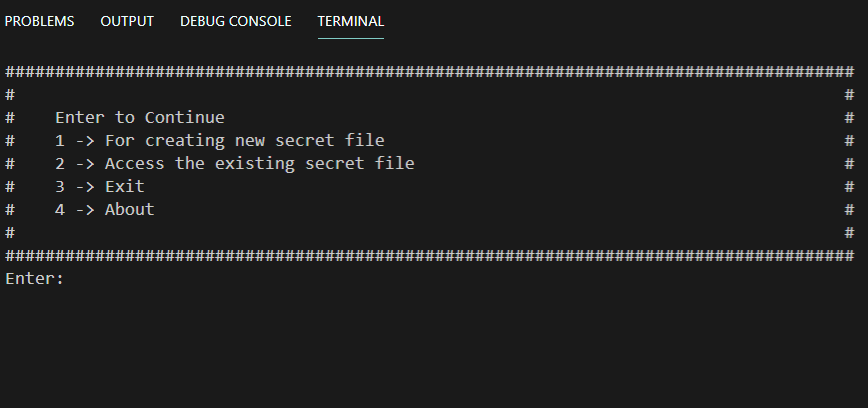

# Secret-File-Store
This is an automation script that can create 100 x 100 x 10 nested folders in your pc and randomly it stores your important file which makes it very hard to find that files and to get the location of your stored file you require a password.

# Requirement
Python
(for best experince please use terminal/command prompt/cmd to run the script)
